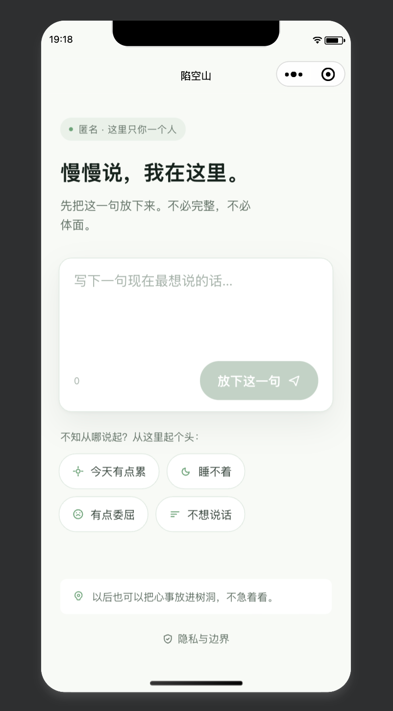
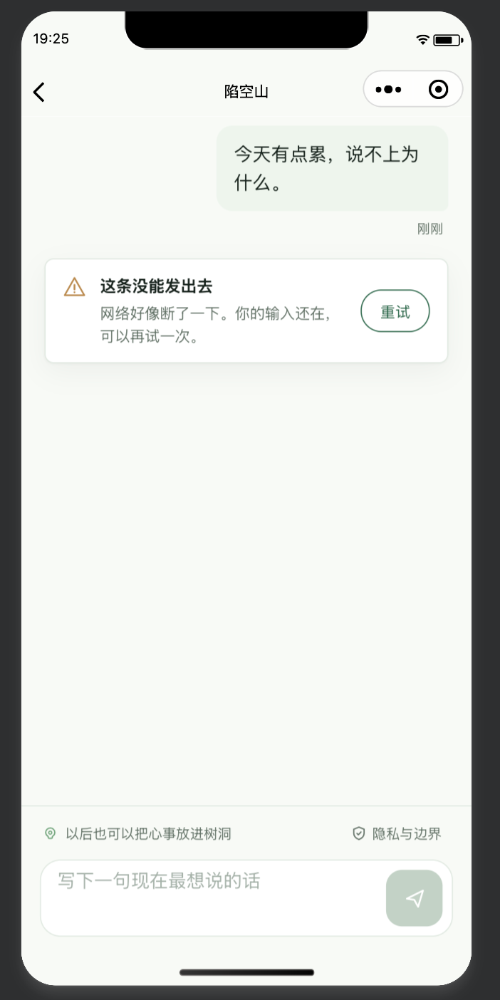

# 陷空山 V2

> **匿名情绪陪伴微信小程序**——放下一句心事，得到一次克制的回应；说完即走，不被挽留、不被画像、不用于训练。
> Taro 4 + React + TypeScript（严格模式）· 微信云开发 BFF · AI 统一经 `aiGateway`（DeepSeek，密钥只在云端）· 由自建 AI Harness 驱动交付。

## 界面实况（真机）

| 首页 · 日间主题 | 会话页 · 网络失败态 |
| --- | --- |
|  |  |
| 匿名 kicker、起头词、树洞提示，渲染逐字对齐设计契约 | 错误卡 + 重试：输入不丢、文案对齐契约；云链未通期间所摄 |

> 截图说明见 [`docs/screenshots/README.md`](./docs/screenshots/README.md)；正常回复态截图待云链真机通过后补拍替换。

## 硬边界（产品气质）

- **匿名即逝**：无需注册；不收集手机号/头像/位置；会话默认即逝，可随时清除。
- **反依赖**：无 streak、无推送召回、无未读红点、无首屏历史 feed——陪伴不靠留人暗黑模式。
- **风险四档**：`none / low / medium / high`；高危表达**让位安全协议**，而非被审核拦截。
- **不声明未实现的安全能力**：是情绪支持，不是医疗诊断或危机干预；不说「端到端加密」「零风险」。

## 技术栈

| 层 | 选型 |
| --- | --- |
| 前端框架 | Taro 4.2（weapp + h5 双端）|
| UI | React 18 + TypeScript 严格模式 |
| BFF | 微信云开发云函数（`login` / `aiGateway`）|
| AI | DeepSeek，经 `aiGateway` 隔离归一化；密钥只在云端环境变量 |
| 构建 | webpack 5.91（钉死）· Vitest · ESLint 9 |
| 门禁 | `npm run verify` = typecheck + lint + test + build:weapp |

## 分层架构

```text
pages     路由 / 页面外壳 / 生命周期装配
features  UI 层交互编排（home / chat / privacy / theme）
domain    业务类型 / 用例 / 校验（纯函数 + 单测）：chat 风险态 · anti-dependency 四层
infra     微信 API / 云函数客户端 / 提供方适配器（stub ⇄ cloud 工厂切换）
shared    稳定基础类型 / 结果与错误 / UI 规格唯一源
```

数据流（单向，边界铁律在 `harness/rules.md §4/§5`）：

```text
用户一句 → pages → features(useChat) → domain(usecases/riskState)
        → infra(cloudGateway) → 云函数 aiGateway → DeepSeek
        → 归一化 ChatReply{ id, content, riskLevel, createdAt } → UI
```

- 页面层禁止直接 `wx.cloud.callFunction`；全仓仅 `infra` 两处出口。
- UI 永不接触提供方原生字段，只消费 `ChatReply`。

## AI 网关与 prompt 红线

`aiGateway` 是 UI 与 AI/身份之间**唯一**边界（ADR-003）：服务端高危兜底（不依赖模型可用性）→ 输入/输出双向 `msgSecCheck` → DeepSeek 生成与判级 → 归一化返回。

系统提示词规格权威源在 [`cloudfunctions/aiGateway/prompt.js`](./cloudfunctions/aiGateway/prompt.js)，红线逐条可查：

- 不诊断、不治疗、不开处方；不自称医生/咨询师。
- 不夸大承诺（不说「绝对安全」「我能救你」）；不编造热线号码。
- CBT 温和动作可用：区分事实与想法、识别灾难化、温和现实检验。
- `high` 仅危机信号触发，content 留空由客户端接管安全引导。

## UI 像素契约与 spec 护栏

- **设计契约**：`reference/陷空山UX设计/{home,chat,design-system}.html`（像素级事实源，入库）。
- **规格唯一源**：`src/shared/ui/spec.ts`（BASE_TOKENS / 时段 PALETTES / GEOMETRY），逐字沉淀自契约。
- **纪律**：改 UI 数值先改 `spec.ts` + `spec.test.ts`，再改 scss；禁止绕过 spec 直改样式。
- **三向交叉护栏**：`spec.test.ts` 断言 spec ⇔ 契约 HTML ⇔ 实现 scss 三方一致，常绿即合并门禁。
- weapp 真机坑已固化进护栏：WXSS 不识 `:root`（双发 `page`）、不支持 `mask-image`（`<image>` 烤色）、scroll-view 吃自身 padding（内层 wrapper）。

## AI Harness（本仓库的交付方式）

本项目由 AI 执行器在自建 harness 下协作交付——**规则、协议、进度、记忆四分离**：

| 文件 | 职责 |
| --- | --- |
| `harness/rules.md` | 最高工程规则与裁决顺序 |
| `harness/protocol.md` | 执行器协议（任务 IO、收尾、评审模式） |
| `harness/plan.md` | 待办唯一事实源（Stage A–E 追踪） |
| `harness/memory.md` | 跨会话状态/坑唯一事实源（`## NEXT` 取任务） |

- **冷启动协议**：任何新窗口先读 memory `## NEXT` → plan 取最靠前未勾选「我」项 → 实现 → `npm run verify` → 勾选 plan + 刷新 memory。没有验证，就没有完成。
- **评审门禁**：破坏边界 / 未批准依赖 / 无类型领域行为 / 文档矛盾 / 静默扩范围 / 未实现安全声明——任一即不通过。
- 架构决策沉淀为 ADR（`docs/adr/`），已裁决问题禁止重开。

## 验证

```bash
npm install --legacy-peer-deps
npm run verify   # typecheck + lint + test + build:weapp
```

单测覆盖：UI spec 三向护栏 · colorTokens · anti-dependency 四层 · 风险状态机（`riskState.test.ts`）。

## 环境与本地起步

1. 复制 `.env.example` → `.env`，按需填 `TARO_APP_CLOUD_ENV`（云环境 ID）；留空用开发者工具当前环境。`.env` 不入库。
2. 复制 `project.config.example.json` → `project.config.json`，填入**你自己的 AppID**（该文件含账号标识，不入库）。
3. 微信开发者工具打开项目，开通云开发；部署 `login` / `aiGateway`；为 `aiGateway` 配 `DEEPSEEK_API_KEY`（不入库）；**超时设 60 秒**。
4. 详见 [`cloudfunctions/README.md`](./cloudfunctions/README.md)。

## 当前状态

> 活状态以 `harness/` 为准。

- 仓库侧产品 MVP 完成：Stage A–C + D4 + B7/B8/B9 收敛轮，`verify` 全绿；真机 UI 已验（见上）。
- 进行中：云函数真机链路打通 + 体验版冒烟（P0，微信/云侧人工）。
- 上线后增量（P2）：opt-in 本地会话留存（ADR-005）、可观测性、反依赖真实数据打磨。

## 文档导航

- 规则/协议/进度/记忆：`harness/`
- 架构/验证/索引/隐私：`docs/`（`architecture.md` · `verification.md` · `privacy-guideline.md`）
- 决策：`docs/adr/ADR-001~005`
- 产品契约与设计契约：`reference/陷空山UX设计/`
- 冒烟清单：`harness/checklists/mvp-smoke.md`

## 状态声明

- 小程序**未公开上架**（体验版内测阶段；上架合规见 `harness/plan.md` D3）。
- 仓库作为公开作品维护；README 只陈述已实现、已验证的行为。
